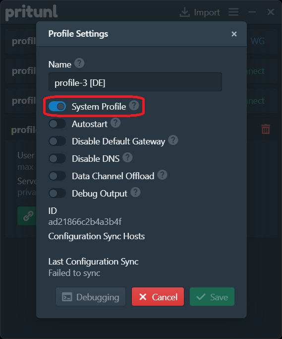
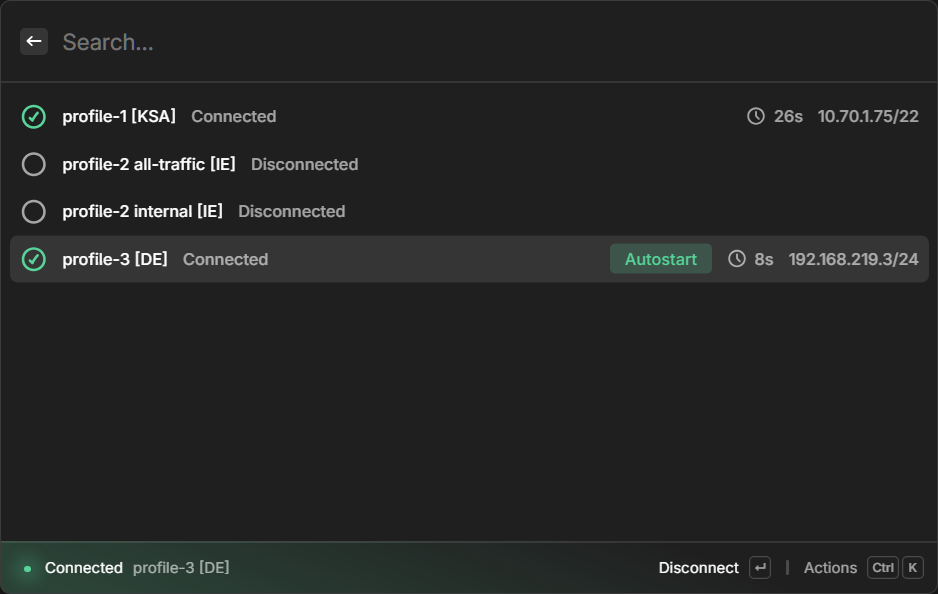
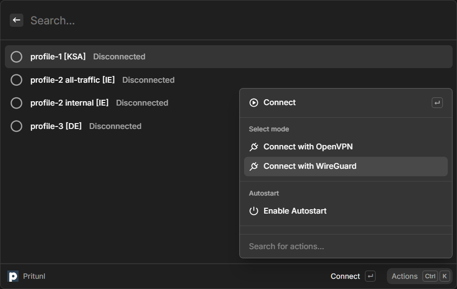
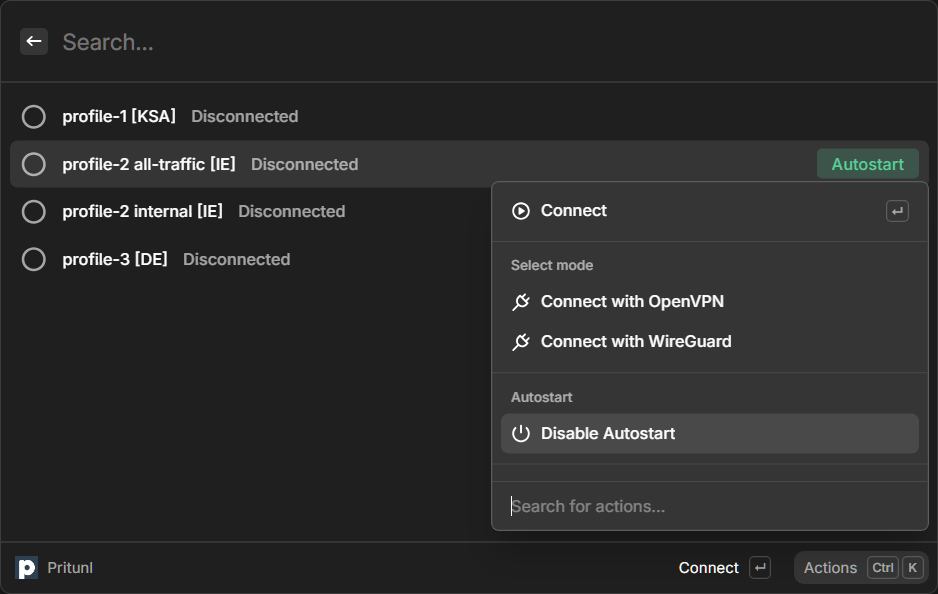
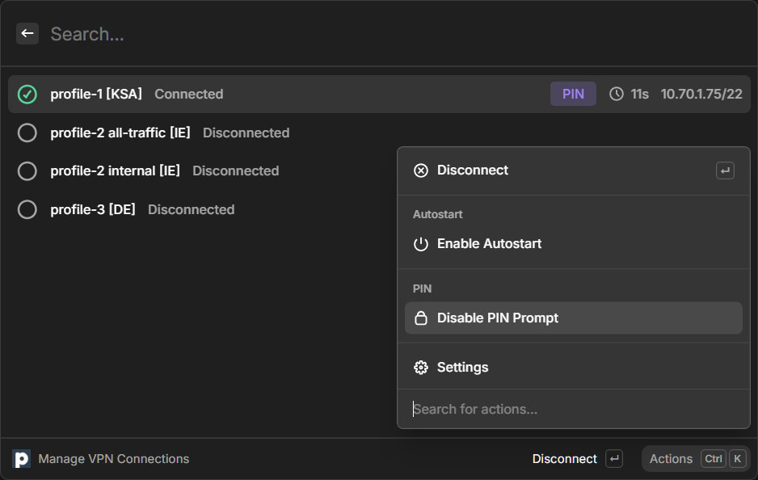
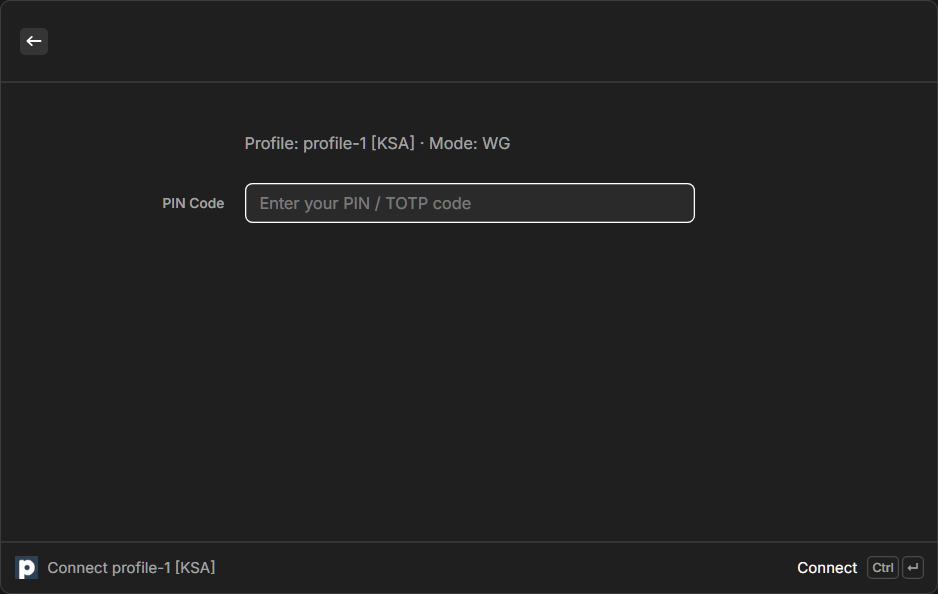

# Pritunl Connections

This extension allows to manage VPN connections for existing profiles in Pritunl.

# Requirements

- [Pritunl client](https://client.pritunl.com/#install) for macOS or Windows installed
- VPN profile(s) imported
- VPN profile(s) to be managed from Raycast have to be set as **System Profiles**

To set profile as a System Profile:

1. launch Pritunl Client
2. select relevant profile
3. press **Settings**
4. enable **System Profile**
4. *optionally disable Autostart*

# Configuration

No configuration from user side should be necessary, however the following options are customizable:

### Pritunl application

The Pritunl client should be selected by default in the app picker dialog. On Windows an `.lnk` to `pritunl.exe` is expected, and on macOS an `.app` bundle.

### Connection timeout

How long to wait before giving up, default is `30` (seconds).

# Features

### Show a list of profiles

- profile name
- connection status
- autostart status
- connection uptime
- client IP

### Connect

Connection can be toggled by clicking on a selected profile.

Optionally under **Actions** a mode can be selected (OpenVPN / WireGuard), using a different mode will save it as default for future connections for this profile.

### Profile Autostart

A profile can set to Autostart using the Actions menu. A UI indicator will be visible for a profile with Autostart enabled.

### Enable PIN / TOTP prompt

If your profile requires a password / PIN / TOTP to connect you can enable PIN prompt in the Actions menu.

